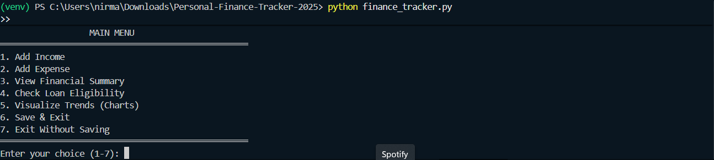
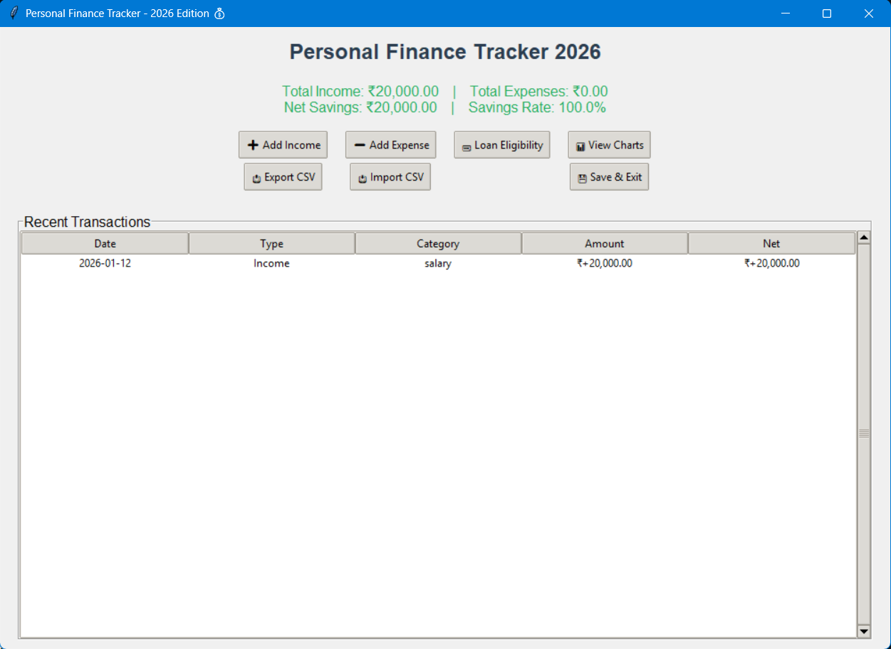
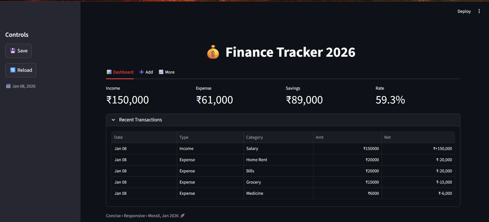
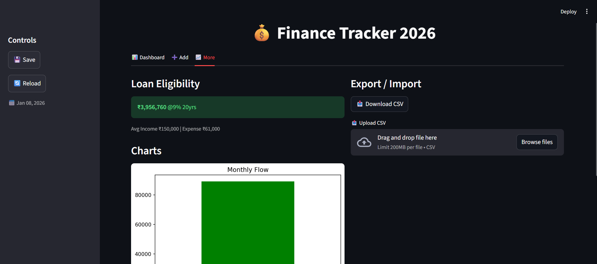

# Personal-Finance-Tracker-2025
Personal Finance Tracker built with Python to manage income, expenses, loan eligibility, and financial insights using CLI, GUI, and web interfaces.
<h1 align="center">💰 Personal Finance Tracker (2025–2026)</h1>

<p align="center">
  <b>Track • Analyze • Visualize • Plan</b><br>
  A Python-based personal finance tracker with CLI, GUI, and Web interfaces.
</p>

<p align="center">
  
  
  
  
  
  
</p>
## 📸 Screenshots

### CLI Version


### GUI Version


### Web Dashboard



Below is a **clean, copy-paste ready README section** for **installation and running the project**, written in **simple steps** and suitable for GitHub.

You can add this under a heading like **“Installation & Usage”** in your `README.md`.

---

## ⚙️ Installation & Run Instructions

Follow these steps to install dependencies and run the **Personal Finance Tracker** on your system.

---

### 📌 Prerequisites

Make sure you have the following installed:

* **Python 3.8 or above**
* **pip** (Python package manager)
* **Git** (optional, for cloning)

Check versions:

```bash
python --version
pip --version
```

---

## 📥 Step 1: Clone the Repository

```bash
git clone https://github.com/<your-username>/Personal-Finance-Tracker-2025.git
cd Personal-Finance-Tracker-2025
```

*(Or download ZIP and extract it)*

---

## 📦 Step 2: Install Required Libraries

Install dependencies using pip:

```bash
pip install pandas matplotlib streamlit
```

> **Note:** `tkinter` comes pre-installed with Python on most systems.

---

## ▶️ Step 3: Run the Project

### 🔹 Option 1: Command Line Version (CLI)

```bash
python finance_tracker.py
```

* Interactive menu-driven application
* Best for understanding core logic

---

### 🔹 Option 2: Desktop GUI Version (Tkinter)

```bash
python finance_tracker_gui.py
```

* Opens a desktop window
* Supports charts, loan calculation, CSV import/export

---

### 🔹 Option 3: Web Dashboard (Streamlit)

```bash
streamlit run finance_tracker_web.py
```

* Opens in browser at `http://localhost:8501`
* Interactive dashboard with charts and metrics

---

## 💾 Data Storage

* Financial data is stored in **JSON files**
* Automatic **backup files** are created before overwriting data
* Sample files included:

  * `finance_data_2025.json`
  * `finance_data_2026.json`

---

## 🛠 Troubleshooting

**Module not found error**

```bash
pip install <module-name>
```

**Streamlit not recognized**

```bash
pip install streamlit
```

**Tkinter issues (Linux)**

```bash
sudo apt-get install python3-tk
```

---

## ✅ You're Ready!

Your **Personal Finance Tracker** is now running successfully 🎉
Start adding transactions and explore financial insights.


